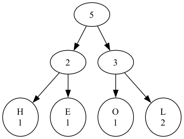

# Huffman Encoding Implementation

## Overview

This Python implementation demonstrates the Huffman coding algorithm for text compression. The algorithm assigns shorter codes to more frequent characters, optimizing the overall compression.

## Installation

To use the Huffman Encoder, follow these steps:

1. Clone the repository:

    ```bash
    git clone git@github.com:geekyharsh05/Huffman-Encoder.git
    ```

2. Navigate to the project directory:

    ```bash
    cd Huffman-Encoder
    ```

## Visualization

The script generates a visual representation of the Huffman tree using the `graphviz` library. The visualization is saved as 'huffman_tree.png' in the current working directory.

To view the Huffman tree visualization, follow these steps:

1. After running the script, check the current working directory for the generated 'huffman_tree.png' file.

2. Open the 'huffman_tree.png' file using an image viewer of your choice.

The visualization provides a graphical representation of the Huffman tree structure, showing the relationships between nodes and their frequencies.

Feel free to explore and analyze the generated Huffman tree to gain insights into the encoding structure of the input text.

## Example

```bash
python src/main.py
```

## User Input Example

```bash
Enter the text you want to encode: HELLO
```

## Expected Output

```bash
Encoded text:  00 01 11 11 10
Codes: {'H': ' 00', 'E': ' 01', 'O': ' 10', 'L': ' 11'}
Huffman Tree has been drawn and saved as 'huffman_tree.png'
```


